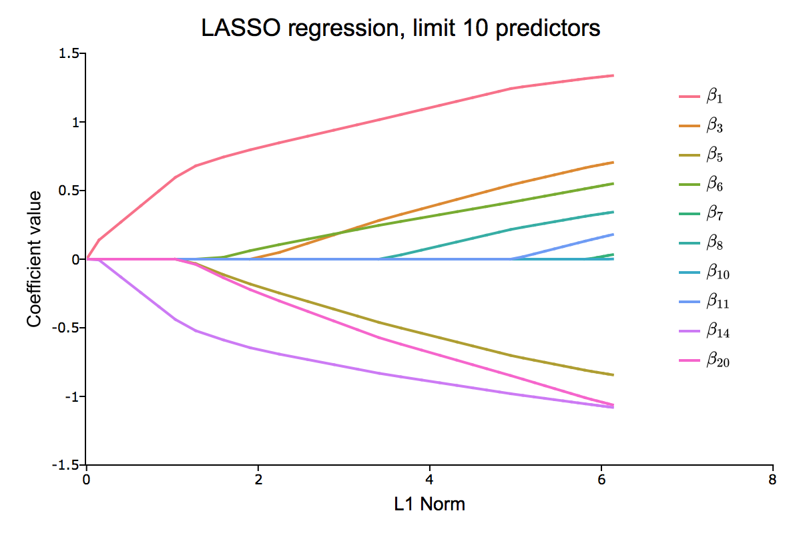

# gauss-glmnet
A GAUSS wrapper of the glmnet package for fitting generalized linear models via penalized maximum likelihood.

## Getting Started

### Prerequisites
The program files require a working copy of GAUSS 18+. It could be made to work back to GAUSS version 16. 

### Installation

1. Click the **Release** tab towards the top of this page.
2. Download the package zip file.
3. Use the [GAUSS Application Installer](https://www.aptech.com/support/installation/using-the-applications-installer-wizard/) by selecting **Tools &gt; Install Application** from the main GAUSS menu.

### Examples

After installation the example files and data will be located in `pkgs/glmnet/examples` under your GAUSS installation directory. 

### Documentation

Documentation for the main function, `glmnetFit` can be found [here](https://github.com/aptech/gauss-glmnet/blob/master/docs/glmnetfit.md).
